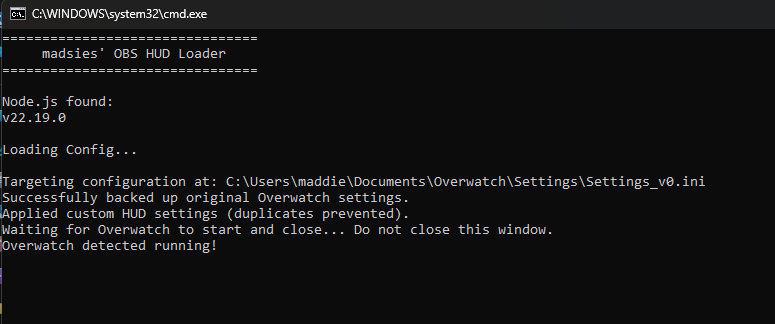
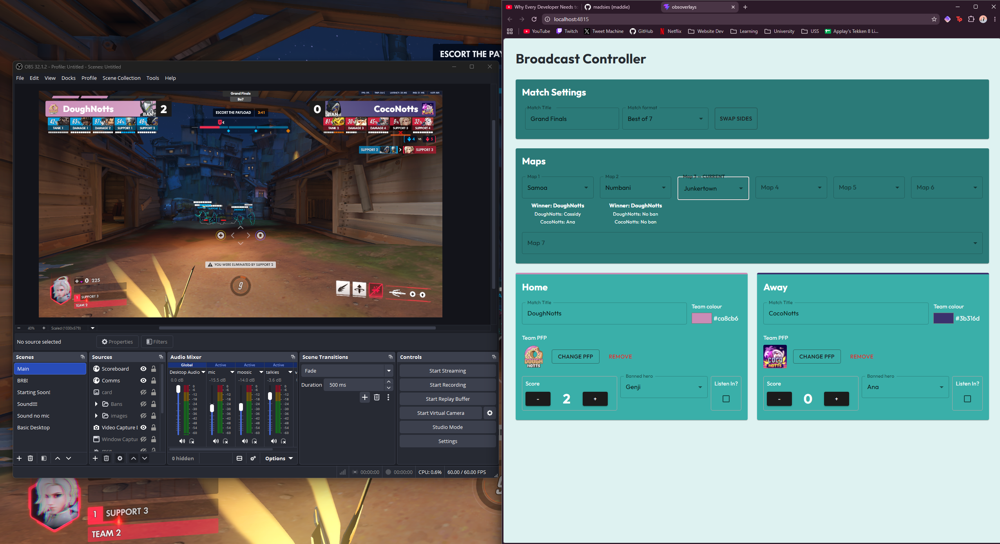
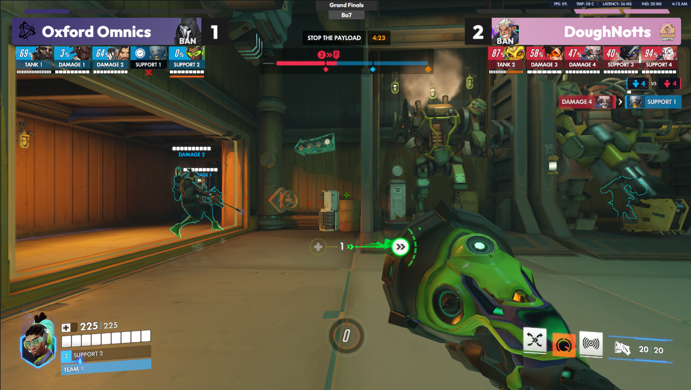
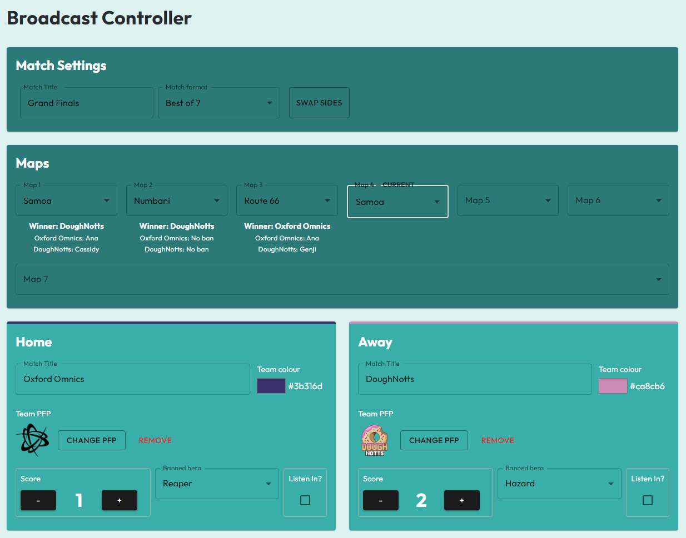

# Overwatch Broadcast Overlay

This program is used by producers and provides dynamic, modern graphics to OBS Streams, with much customisability & ease of use.

## Set Up
### In OBS, Add Browser Sources:
- http://localhost:4815/overlay/scoreboard > Upper Third, Teams and Scores
- http://localhost:4815/overlay/listenin > Pop-in Tooltips for listening to player comms
- http://localhost:4815/overlay/info > (WIP) Between-Map Full Screen Information, Players, Map information etc.

#### Make sure that the resolution is set to 1920 x 1080 in the browser for the best visuals !!!

### For Observers
- This overlay is designed with 1.00000 BroadcastMargin in the overwatch .ini config file
- There is a .bat program attached `OBSConfigEditor.zip` that handles this automatically, and removes it cleanly when the game is closed.
- ONLY the observers of the game need this program running.

## Features
### Customisable Team Details
- Team Name
- Team Picture
- Team Colour
###  Match Details
- Score
- Hero Bans
- Match Title
### Broadcast Flair
- Pop-In booleans for mic listen-ins
- Match History with hero bans and winners.

## Images

### OBS Config Editor

### Full Production Setup

